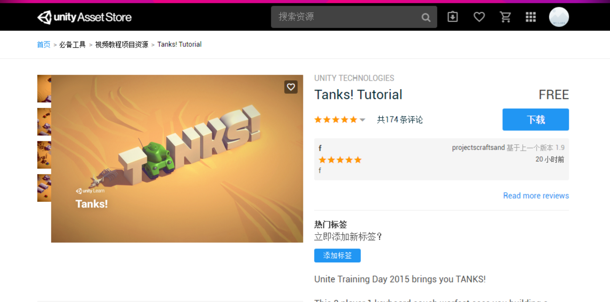
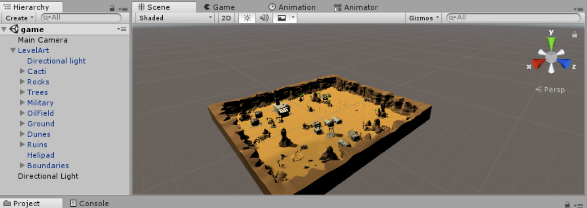
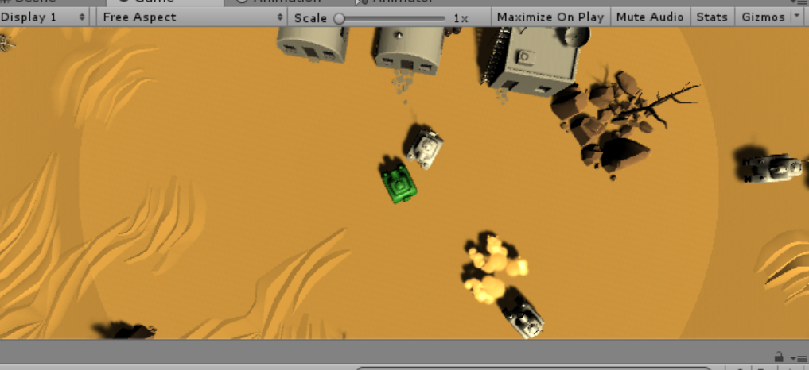

 ### Unity3d||坦克对战游戏 AI 设计 

### 一、题目要求

从商店下载游戏：“Kawaii” Tank 或 其他坦克模型，构建 AI 对战坦克。具体要求

- 使用“感知-思考-行为”模型，建模 AI 坦克
- 场景中要放置一些障碍阻挡对手视线
- 坦克需要放置一个矩阵包围盒触发器，以保证 AI 坦克能使用射线探测对手方位
- AI 坦克必须在有目标条件下使用导航，并能绕过障碍。（失去目标时策略自己思考）
- 实现人机对战

### 二、设计过程

- 下载素材

  从商店下载游戏： “Tanks! Tutorial” 

  

- 使用資源的预制体，添加地图，坦克等预制，需要给坦克和目标坦克添加碰撞器。

- 需要给坦克放在触发器

最后的设置如下



- 代码设计部分	

  需要先定义坦克的类，给定坦克的血量，运动，发射子弹等对应的操作函数

  由Tank.cs 决定

  - 血量

  ```
  private float hp =500.0f;
  
       public Tank()
       {
           hp = 500.0f;
       }
  
       public float getHP()
       {
           return hp;
       }
  
       public void setHP(float hp)
       {
           this.hp = hp;
       }
  ```

  - 射击函数

    ```
    public void shoot(TankType type)
         {
             GameObject bullet = Singleton<MyFactory>.Instance.getBullets(type);
             bullet.transform.position = new Vector3(transform.position.x, 1.5f, transform.position.z) + transform.forward * 1.5f;
             bullet.transform.forward = transform.forward; //方向
             bullet.GetComponent<Rigidbody>().AddForce(bullet.transform.forward * 20, ForceMode.Impulse);
         }
    ```

  玩家类和敌人类的设计分别在坦克类上进行实现

  玩家类 player.cs

  需要定义摧毁，前进的函数

  摧毁

  ```
  public delegate void DestroyPlayer();
  ```

  

  前进后移和转向函数

  ```
  public void moveForward()
     {
         gameObject.GetComponent<Rigidbody>().velocity = gameObject.transform.forward * 30;
     }
     public void moveBackWard()
     {
         gameObject.GetComponent<Rigidbody>().velocity = gameObject.transform.forward * -30;
     }
     public void turn(float offsetX)
     {
         float x = gameObject.transform.localEulerAngles.x;
         float y = gameObject.transform.localEulerAngles.y + offsetX*2;
         gameObject.transform.localEulerAngles = new Vector3(x, y, 0);
     }
  ```

  敌人类

  需要使用工厂模式进行处理

  需要设计回收机制，以及需要判断游戏是否结束，和监测玩家坦克位置

  需要向玩家位置移动并进行间隔1-3秒的射击

  寻路

  ```
   void Update() {
         playerLocation = GameDirector.getInstance().currentSceneController.getPlayer().transform.position;
         gameover = GameDirector.getInstance().currentSceneController.getGameOver();
         if (!gameover)
         {
             if (getHP() <= 0 && recycleEnemy != null)
             {
                 recycleEnemy(this.gameObject);
             }
             else
             {
                 // 自动向player移动
                 NavMeshAgent agent = gameObject.GetComponent<NavMeshAgent>();
                 agent.SetDestination(playerLocation);
                // gameObject.transform.position = new Vector3(transform.position.x+0.01f,transform.position.y,transform.position.z);
             }
         }
         else
         {
             //游戏结束，停止寻路
             NavMeshAgent agent = gameObject.GetComponent<NavMeshAgent>();
             agent.velocity = Vector3.zero;
             agent.ResetPath();
         }
     }
  ```

  间隔射击

  ```
   IEnumerator shoot()
     {
         while (!gameover)
         {
             for(float i =1;i> 0; i -= Time.deltaTime)
             {
                 yield return 0;
             }
             if(Vector3.Distance(playerLocation,gameObject.transform.position) < 14)
             {
                 shoot(TankType.ENEMY);
             }
         }
     }
  ```

  子弹类 bullet .cs

  定义伤害值和是否射中目标

  剩下的分别定义需要的导演类，

  管理坦克的工厂类，

  管理UI

  场景类

  ```
  // SceneController.cs
  public class SceneController : MonoBehaviour,IUserAction{
      public GameObject player;
      private int enemyCount = 6;
      private bool gameOver = false;
      private GameObject[] enemys;
      private MyFactory myFactory;
      public GameDirector director;
      private void Awake()
      {
          director = GameDirector.getInstance();
          director.currentSceneController = this;
          enemys = new GameObject[enemyCount];
          gameOver = false;
          myFactory = Singleton<MyFactory>.Instance;
  
      }
  
      void Start () {
          player = myFactory.getPlayer();
          for (int i = 0; i < enemyCount; i++)
          {
              enemys[i]=myFactory.getEnemys();
          }
          Player.destroyEvent += setGameOver;
      }
  
      // Update is called once per frame
      void Update () {
          Camera.main.transform.position = new Vector3(player.transform.position.x, 18, player.transform.position.z);
      }
  
      //返回玩家坦克的位置
      public GameObject getPlayer()
      {
          return player;
      }
  
      //返回游戏状态
      public bool getGameOver()
      {
          return gameOver;
      }
  
      //设置游戏结束
      public void setGameOver()
      {
          gameOver = true;
      }
  
      public void moveForward()
      {
          player.GetComponent<Player>().moveForward();
      }
      public void moveBackWard()
      {
          player.GetComponent<Player>().moveBackWard();
      }
  
      //通过水平轴上的增量，改变玩家坦克的欧拉角，从而实现坦克转向
      public void turn(float offsetX)
      {
          player.GetComponent<Player>().turn(offsetX);
      }
  
      public void shoot()
      {
          player.GetComponent<Player>().shoot(TankType.PLAYER);
      }
  }
  
  //IUserAction.cs
  public interface IUserAction
  {
      void moveForward();
      void moveBackWard();
      void turn(float offsetX);
      void shoot();
      bool getGameOver();
  }
  ```

  

  然后使用单例模式，需要单例类

  ```
  //Singleton.cs
  public class Singleton<T> : MonoBehaviour where T :MonoBehaviour {
     protected static T instance;
     public static T Instance
     {
         get
         {
             if(instance == null)
             {
                 instance = (T)FindObjectOfType(typeof(T));
                 if(instance == null)
                 {
                     Debug.LogError("An instance of " + typeof(T) + " is needed in the scene , but there is none.");
                 }
             }
             return instance;
         }
     }
  }
  ```

  


实验结果

