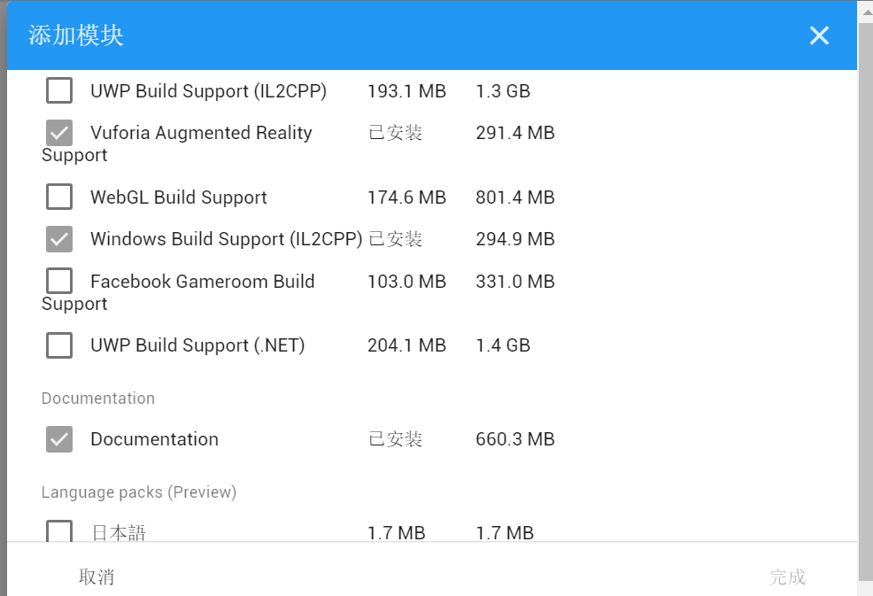

## Unity3d||  AR/MR 技术

- 视频地址https://www.bilibili.com/video/av80398890/
- 虚拟按键小游戏


- 配置Unity环境 使用版本：Unity3d2018.4.13c1

  可以直接添加模块

  

  完成之后可以直接打开unity

  点击顶部菜单栏“GameObject”-“Vuforia”-“ARCamera”，导入数据

  import模块

  之后会生成一个ARCamera，但是可能会报无法open vuforia configuration的错误

  然后需要打开“File”-“Build Settings”进行平台选择切换，确定开发的应用平台，安卓还是苹果，或者其他，然后配置“Player Setting”下“XR Setting”，勾选使能“Vuforia Augmented Reality”

  然后就可以添加生成的key

  在vuforia网站上，生成自己的key和添加自己的数据库，

  上传图片

  

  

  下载

  ​	生成的package

  导入

  点击顶部菜单栏“GameObject”-“Vuforia”-“image”，生成image模块

  选择好image的数据库和图片

  将准备好的龙预制添加到image的子对象中

  unity激活数据库。

  然后运行，跳转龙的大小，就可以看到

  结果

  

  ​	

- 接下来还要添加蓝色按键

  点击 ImageTarget ，在其 Inspector 面板中找到 Image Target Behaviour 组件，可以看到 Advanced部件，展开后看到 Add Virtual Button 按钮，点击该按钮即可添加虚拟按钮

- 然后龙运动的代码如下

  龙可以向上移动

  ```
  public class VirtualButtonEventHandler : MonoBehaviour, IVirtualButtonEventHandler {
      public VirtualButtonBehaviour[] vbs;
      public GameObject cube;
  
      void Start() {
          vbs = GetComponentsInChildren<VirtualButtonBehaviour>();
          for (int i = 0; i < vbs.Length; i++) {
              vbs[i].RegisterEventHandler(this);
          }
      }
  
  
      public void OnButtonPressed(VirtualButtonBehaviour vb) {
  		cube.GetComponent<Renderer>().material.color = Color.red;
      }
      void Update() {
          
      }
  }
  
  
  ```

  