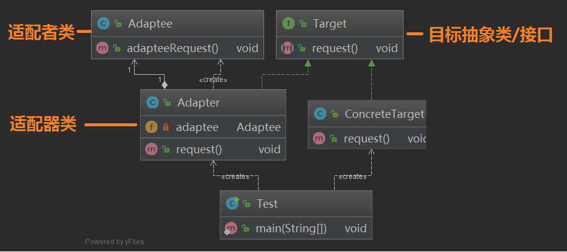

### Unity3d游戏作业||物理系统与碰撞

1、改进飞碟（Hit UFO）游戏：

- 游戏内容要求：
  1. 按 *adapter模式* 设计图修改飞碟游戏
  2. 使它同时支持物理运动与运动学（变换）运动


- UML图

  

- 适配器模式

  适配器模式(Adapter Pattern)：将一个接口转换成客户希望的另一个接口，使接口不兼容的那些类可以一起工作，其别名为包装器(Wrapper)。适配器模式既可以作为类结构型模式，也可以作为对象结构型模式。

  在适配器模式中，我们通过增加一个新的适配器类来解决接口不兼容的问题，使得原本没有任何关系的类可以协同工作。

  根据适配器类与适配者类的关系不同，适配器模式可分为对象适配器和类适配器两种，在对象适配器模式中，适配器与适配者之间是关联关系；在类适配器模式中，适配器与适配者之间是继承（或实现）关系。
  

- 使用adapter模式

  这次需要新增加一个管理飞碟飞行的物理运动的PhysicisActionManager

  在FirstController中需要调用这两个Manager类，这就需要管理多个功能相同的组件，为了保证代码的结构，可以使用适配器模式来对相同的组件进行管理。

  增加一个ActionManagerAdapter类来进行所有动作的管理

  

  在adapter中定义两Manager，通过set和get来对使用的Manager进行切换

  ```
  using System.Collections;
  using System.Collections.Generic;
  using UnityEngine;
  using MyGame;
  
  public class ActionManagerAdapter
  {
      //定义两个Manager
      ActionManager normalAM;
      PhysicsActionManager PhysicsAM;
  
      public int mode = 0; // 0->normal, 1->physics
  
      public ActionManagerAdapter(GameObject main)
      {
          normalAM = main.AddComponent<ActionManager>();
          PhysicsAM = main.AddComponent<PhysicsActionManager>();
          mode = 0;
      }
  
      public void SwitchActionMode()
      {
          mode = 1 - mode;
      }
  
      public void PlayDisk(int round)
      {
          if (mode == 0)
          {
              Debug.Log("normalAM");
              normalAM.playDisk(round);
          }
          else
          {
              Debug.Log("physicsAM");
              PhysicsAM.playDisk(round);
          }
      }
  
      public void SetNormalAM(ActionManager am)
      {
          normalAM = am;
      }
  
      public void SetPhysicsAM(PhysicsActionManager pam)
      {
          PhysicsAM = pam;
      }
  
      public ActionManager GetNormalAM()
      {
          return normalAM;
      }
  
      public PhysicsActionManager GetPhysicsAM()
      {
          return PhysicsAM;
      }
  }
  ```


​		PhysicsActionManager类

```
public class PhysicsActionManager : SSActionManager
{
    public FirstControl sceneController;
    public DiskFactory diskFactory;
    public RecordControl scoreRecorder;
    public PhysicsEmit EmitDisk;
    public GameObject Disk;
    int count = 0;
    // Use this for initialization
    protected void Start()
    {
        sceneController = (FirstControl)Director.getInstance().sceneCtrl;
        diskFactory = sceneController.factory;
        scoreRecorder = sceneController.scoreRecorder;
        //sceneController.MyActionManager = this;
        sceneController.myAdapter.SetPhysicsAM(this);
    }

    // Update is called once per frame
    protected new void Update()
    {
        base.Update();
    }

    public void playDisk(int round)
    {
        EmitDisk = PhysicsEmit.GetSSAction();
        Disk = diskFactory.getDisk(round);
        this.AddAction(Disk, EmitDisk, this);
        Disk.GetComponent<DiskControl>().action = EmitDisk;
    }

    public void SSActionEvent(SSAction source)
    {
        if (!source.GameObject.GetComponent<DiskControl>().hit)
            scoreRecorder.miss();
        diskFactory.freeDisk(source.GameObject);
        source.GameObject.GetComponent<DiskControl>().hit = false;
    }
}
```


​		ActionManager类


```

public class ActionManager : SSActionManager
{
    public FirstControl sceneController;
    public DiskFactory diskFactory;
    public RecordControl scoreRecorder;
    public Emit EmitDisk;
    public GameObject Disk;
    // Use this for initialization
    protected void Start()
    {
        sceneController = (FirstControl)Director.getInstance().sceneCtrl;
        diskFactory = sceneController.factory;
        scoreRecorder = sceneController.scoreRecorder;
        //sceneController.MyActionManager = this;
        sceneController.myAdapter.SetNormalAM(this);
    }

    // Update is called once per frame
    protected new void Update()
    {
        base.Update();
    }

    public void playDisk(int round)
    {
        //Debug.Log(diskFactory);
        EmitDisk = Emit.GetSSAction();
        Disk = diskFactory.getDisk(round);
        this.AddAction(Disk, EmitDisk, this);
        Disk.GetComponent<DiskControl>().action = EmitDisk;
    }

    public void SSActionEvent(SSAction source)
    {
        if (!source.GameObject.GetComponent<DiskControl>().hit)
            scoreRecorder.miss();
        diskFactory.freeDisk(source.GameObject);
        source.GameObject.GetComponent<DiskControl>().hit = false;
    }
}

```


2、打靶游戏（**可选作业**）：

- 游戏内容要求：
  1. 靶对象为 5 环，按环计分；
  2. 箭对象，射中后要插在靶上
     - **增强要求**：射中后，箭对象产生颤抖效果，到下一次射击 或 1秒以后
  3. 游戏仅一轮，无限 trials；
     - **增强要求**：添加一个风向和强度标志，提高难度