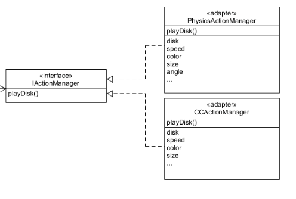

### Unity3d游戏作业||物理系统与碰撞

1、改进飞碟（Hit UFO）游戏：

- 游戏内容要求：
  1. 按 *adapter模式* 设计图修改飞碟游戏
  2. 使它同时支持物理运动与运动学（变换）运动


- UML图

  

- 适配器模式

  适配器模式(Adapter Pattern)：将一个接口转换成客户希望的另一个接口，使接口不兼容的那些类可以一起工作，其别名为包装器(Wrapper)。适配器模式既可以作为类结构型模式，也可以作为对象结构型模式。

  在适配器模式中，我们通过增加一个新的适配器类来解决接口不兼容的问题，使得原本没有任何关系的类可以协同工作。

  根据适配器类与适配者类的关系不同，适配器模式可分为对象适配器和类适配器两种，在对象适配器模式中，适配器与适配者之间是关联关系；在类适配器模式中，适配器与适配者之间是继承（或实现）关系。
  

- 使用adapter模式

  这次需要新增加一个管理飞碟飞行的物理运动的PhysicisActionManager

  在FirstController中需要调用这两个Manager类，这就需要管理多个功能相同的组件，为了保证代码的结构，可以使用适配器模式来对相同的组件进行管理。

  增加一个ActionManagerAdapter类来进行所有动作的管理

  

  在adapter中定义两Manager，通过set和get来对使用的Manager进行切换

  ```
  using System.Collections;
  using System.Collections.Generic;
  using UnityEngine;
  using MyGame;
  
  public class ActionManagerAdapter
  {
      //定义两个Manager
      ActionManager normalAM;
      PhysicsActionManager PhysicsAM;
  
      public int mode = 0; // 0->normal, 1->physics
  
      public ActionManagerAdapter(GameObject main)
      {
          normalAM = main.AddComponent<ActionManager>();
          PhysicsAM = main.AddComponent<PhysicsActionManager>();
          mode = 0;
      }
  
      public void SwitchActionMode()
      {
          mode = 1 - mode;
      }
  
      public void PlayDisk(int round)
      {
          if (mode == 0)
          {
              Debug.Log("normalAM");
              normalAM.playDisk(round);
          }
          else
          {
              Debug.Log("physicsAM");
              PhysicsAM.playDisk(round);
          }
      }
  
      public void SetNormalAM(ActionManager am)
      {
          normalAM = am;
      }
  
      public void SetPhysicsAM(PhysicsActionManager pam)
      {
          PhysicsAM = pam;
      }
  
      public ActionManager GetNormalAM()
      {
          return normalAM;
      }
  
      public PhysicsActionManager GetPhysicsAM()
      {
          return PhysicsAM;
      }
  }
  ```


​		PhysicsActionManager类

```
public class PhysicsActionManager : SSActionManager
{
    public FirstControl sceneController;
    public DiskFactory diskFactory;
    public RecordControl scoreRecorder;
    public PhysicsEmit EmitDisk;
    public GameObject Disk;
    int count = 0;
    // Use this for initialization
    protected void Start()
    {
        sceneController = (FirstControl)Director.getInstance().sceneCtrl;
        diskFactory = sceneController.factory;
        scoreRecorder = sceneController.scoreRecorder;
        //sceneController.MyActionManager = this;
        sceneController.myAdapter.SetPhysicsAM(this);
    }

    // Update is called once per frame
    protected new void Update()
    {
        base.Update();
    }

    public void playDisk(int round)
    {
        EmitDisk = PhysicsEmit.GetSSAction();
        Disk = diskFactory.getDisk(round);
        this.AddAction(Disk, EmitDisk, this);
        Disk.GetComponent<DiskControl>().action = EmitDisk;
    }

    public void SSActionEvent(SSAction source)
    {
        if (!source.GameObject.GetComponent<DiskControl>().hit)
            scoreRecorder.miss();
        diskFactory.freeDisk(source.GameObject);
        source.GameObject.GetComponent<DiskControl>().hit = false;
    }
}
```


​		ActionManager类


```

public class ActionManager : SSActionManager
{
    public FirstControl sceneController;
    public DiskFactory diskFactory;
    public RecordControl scoreRecorder;
    public Emit EmitDisk;
    public GameObject Disk;
    // Use this for initialization
    protected void Start()
    {
        sceneController = (FirstControl)Director.getInstance().sceneCtrl;
        diskFactory = sceneController.factory;
        scoreRecorder = sceneController.scoreRecorder;
        //sceneController.MyActionManager = this;
        sceneController.myAdapter.SetNormalAM(this);
    }

    // Update is called once per frame
    protected new void Update()
    {
        base.Update();
    }

    public void playDisk(int round)
    {
        //Debug.Log(diskFactory);
        EmitDisk = Emit.GetSSAction();
        Disk = diskFactory.getDisk(round);
        this.AddAction(Disk, EmitDisk, this);
        Disk.GetComponent<DiskControl>().action = EmitDisk;
    }

    public void SSActionEvent(SSAction source)
    {
        if (!source.GameObject.GetComponent<DiskControl>().hit)
            scoreRecorder.miss();
        diskFactory.freeDisk(source.GameObject);
        source.GameObject.GetComponent<DiskControl>().hit = false;
    }
}

```


2、打靶游戏（**可选作业**）：

- 游戏内容要求：
  1. 靶对象为 5 环，按环计分；
  2. 箭对象，射中后要插在靶上
     - **增强要求**：射中后，箭对象产生颤抖效果，到下一次射击 或 1秒以后
  3. 游戏仅一轮，无限 trials；
     - **增强要求**：添加一个风向和强度标志，提高难度

- UML

- 

- 箭靶预制

  使用5个圆柱体叠加形成

  

  

  对于每个圆柱体，添加一个MeshRender和Mesh Collider（检测物体碰撞），分别定义颜色位置

  并且挂载脚本collisiondetenction.cs 和 ringdata.cs，这两个脚本主要是负责箭击中靶子后的分数统计和处理，每个圆柱体都要挂载

  

- 箭的预制

  创建一个对象为Arrow，使用一个Cylinder作为箭体，创建子对象head，使用一个Cube作为箭头。箭头Box Collider的Is Trigger打勾，然后给Arrow添加rigidbody。

  关于rigidBody

   *rigidbody*类的功能是用来模拟gameobject对象在现实世界中的物理特性,包括重力,阻力,质量,速度等。 

  需要在箭挂载一个Rigidbooy，来模拟重力和风力

  

  

- 弓的预制

  下载资源，找到可用的形状预制，然后创建一个bow的预制，它包含子对象arrow，制作完成的箭，合在一起形成新的预制

  

  

  

  

  

- 弓箭移动

  使用键盘控制WSAD或上下左右键控制，

  当弓箭移动时保存相机和弓箭相对位置不变（实现相机跟随效果）

  限定弓箭移动范围

  

- 相机布置

  需要布置2个相机，一个是主相机，负责游戏中的界面，和弓箭的位置保存相对不变，一个是靠经箭靶的相机，主要负责射完箭后的第二屏幕，观察箭落在箭靶上的情况。

  CameraFlow,跟随弓箭位置移动

  ```
  public class CameraFlow : MonoBehaviour
  {
      public GameObject bow;               //跟随的物体
      public float smothing = 5f;          //相机跟随的速度
      Vector3 offset;                      //相机与物体相对偏移位置
  
      void Start()
      {
          offset = transform.position - bow.transform.position;
      }
  
      void FixedUpdate()
      {
          Vector3 target = bow.transform.position + offset;
         
          transform.position = Vector3.Lerp(transform.position, target, smothing * Time.deltaTime);
      }
  }
  ```

  ChildCamera 副摄像机，监视箭靶

  ```
  public class ChildCamera : MonoBehaviour
  {   
      public bool isShow = false;                   //是否显示副摄像机
      public float leftTime;                        //显示时间
  
      void Update()
      {
          if (isShow)
          {
              leftTime -= Time.deltaTime;
              if (leftTime <= 0)
              {
                  this.gameObject.SetActive(false);
                  isShow = false;
              }
          }
      }
  
      public void StartShow()
      {
          this.gameObject.SetActive(true);
          isShow = true;
          leftTime = 2f;
      }
  }
  ```

  

- 箭工厂

  关于箭的管理还是同飞碟一样使用工厂模式来进行管理，工厂在ArrowFactory.cs实现

  - 需要变量

    需要得到定义好的弓箭的预制

    正在被使用的弓箭

    未被使用的弓箭队列

    还需要一个场景控制器和场景进行联系

  ```
  public GameObject arrow = null;                             private List<GameObject> used = new List<GameObject>();     
  private Queue<GameObject> free = new Queue<GameObject>();  public FirstSceneController sceneControler;                 
  ```

  - 获取箭函数getArrow

    ```
    public GameObject GetArrow()
    {
    	if (free.Count == 0) {
    		arrow = Instantiate(Resources.Load<GameObject>("Prefabs/arrow"));
    	}
    	else	{
    arrow = free.Dequeue();
            if(arrow.tag == "hit")
            {
            arrow.GetComponent<Rigidbody>().isKinematic = false;
    
            arrow.transform.GetChild(0).gameObject.SetActive(true);
            arrow.tag = "arrow";
            }
    		arrow.gameObject.SetActive(true);
    	}
    
    sceneControler = (FirstSceneController)SSDirector.GetInstance().CurrentScenceController;
    Transform temp = sceneControler.bow.transform.GetChild(2);
    arrow.transform.position = temp.transform.position;
    arrow.transform.parent = sceneControler.bow.transform;
    used.Add(arrow);
    return arrow;
    }
    
    ```

    

  - 回收箭函数freeArrow

    ```
        public void FreeArrow(GameObject arrow)
        {
            for (int i = 0; i < used.Count; i++)
            {
                if (arrow.GetInstanceID() == used[i].gameObject.GetInstanceID())
                {
                    used[i].gameObject.SetActive(false);
                    free.Enqueue(used[i]);
                    used.Remove(used[i]);
                    break;
                }
            }
        }
    ```

- FirstSceneController 第一个场景控制器

  需要的参数

  ```
   public Camera child_camera;                                      //副相机
      public Camera main_camera;                                       //主相机
      public ScoreRecorder recorder;                                   //记录员
      public ArrowFactory arrow_factory;                               //箭工厂
      public ArrowFlyActionManager action_manager;                     //动作管理
      private int[] targetscore = { 30 };                  //每一回合的目标分数
      private int round = 0;                                           //回合
      public GameObject bow;                                          //弓
      private GameObject arrow;                                        //箭                      
      private GameObject target;                                       //靶子         
      private int arrow_num = 0;                                       //每一回合射出的弓箭数
      
      private List<GameObject> arrow_queue = new List<GameObject>();   //在场景中的箭队列
  
      private bool game_over = false;                                  //游戏结束
      private bool game_start = false;                                 //游戏开始
      private bool iswin = false;
      private string wind = "";                                        //风的方向和等级
      private float wind_directX;                                      //风x轴方向的力大小         
      private float wind_directY;                                      //风y轴方向的力大小
  
  ```

  //初始化

  ```
      void Start ()
      {
          SSDirector director = SSDirector.GetInstance();
          arrow_factory = Singleton<ArrowFactory>.Instance;
          recorder = Singleton<ScoreRecorder>.Instance;
          director.CurrentScenceController = this;
          action_manager = gameObject.AddComponent<ArrowFlyActionManager>() as ArrowFlyActionManager;
          LoadResources();
          main_camera.GetComponent<CameraFlow>().bow = bow;
          //初始化风的方向
          wind_directX = Random.Range(-1, 1);
          wind_directY = Random.Range(-1, 1);
          //生成风
          CreateWind();
      }
  ```

  //每帧渲染

  ```
  	void Update ()
      {
          if(game_start)
          {
              for (int i = 0; i < arrow_queue.Count; i++)
              {
                  GameObject temp = arrow_queue[i];
                  //场景中超过5只箭或者超出边界则回收箭
                  if (temp.transform.position.z > 30 || arrow_queue.Count > 5)
                  {
                      arrow_factory.FreeArrow(arrow_queue[i]);
                      arrow_queue.Remove(arrow_queue[i]);
                  }
              }
          }
      }
  ```

  加载预制

      public void LoadResources()
      {
          bow = Instantiate(Resources.Load("Prefabs/bow", typeof(GameObject))) as GameObject;
          bow.transform.rotation = Quaternion.Euler(90f, 0.0f, 90f);
          target = Instantiate(Resources.Load("Prefabs/target", typeof(GameObject))) as GameObject;
      }

  弓箭的移动

      public void MoveBow(float offsetX, float offsetY)
      {
          //游戏未开始时候不允许移动弓
          if (game_over || !game_start)
          {
              return;
          }
          //弓是否超出限定的移动范围
          if (bow.transform.position.x > 5)
          {
              bow.transform.position = new Vector3(5, bow.transform.position.y, bow.transform.position.z);
              return;
          }
          else if(bow.transform.position.x < -5)
          {
              bow.transform.position = new Vector3(-5, bow.transform.position.y, bow.transform.position.z);
              return;
          }
          else if (bow.transform.position.y < -3)
          {
              bow.transform.position = new Vector3(bow.transform.position.x, -3, bow.transform.position.z);
              return;
          }
          else if (bow.transform.position.y > 5)
          {
              bow.transform.position = new Vector3(bow.transform.position.x, 5, bow.transform.position.z);
              return;
          }
      
          //弓箭移动
          offsetY *= Time.deltaTime;
          offsetX *= Time.deltaTime;
          bow.transform.Translate(0, -offsetX, 0);
          bow.transform.Translate(0, 0, -offsetY);
      }
  射击控制

      public void Shoot()
      {
          if((!game_over || game_start) && arrow_num <= 10)
          {
              arrow = arrow_factory.GetArrow();
              arrow_queue.Add(arrow);
              //风方向
              Vector3 wind = new Vector3(wind_directX, wind_directY, 0);
              //动作管理器实现箭飞行
              action_manager.ArrowFly(arrow, wind);
              //副相机开启
              child_camera.GetComponent<ChildCamera>().StartShow();
              //用户能射出的箭数量减少
              recorder.arrow_number--;
              //场景中箭数量增加
              arrow_num++;
          }
      }
  接口函数实现

      //获得分数
      public int GetScore()
      {
          return recorder.score;
      }
      //获得目标分数
      public int GetTargetScore()
      {
          return recorder.target_score;
      }
      //获得剩余箭数量
      public int GetResidueNum()
      {
          return recorder.arrow_number;
      }
      //得到游戏结束标志
      public bool GetGameover()
      {
          return game_over;
      }
      public bool GetisWin()
      {
          return iswin;
      }
      //得到风的字符串
      public string GetWind()
      {
          return wind;
      }
          //开始游戏
          public void BeginGame()
          {
              game_start = true;
          }
  重新开始

  ```
     //重新开始
      public void Restart()
      {
          game_over = false;
          recorder.arrow_number = 10;
          recorder.score = 0;
          recorder.target_score = 30;
          round = 0;
          arrow_num = 0;
          for (int i = 0; i < arrow_queue.Count; i++)
          {
              arrow_factory.FreeArrow(arrow_queue[i]);
          }
          arrow_queue.Clear();
      }
  
  ```

  检测状态

  ```
     public void CheckGamestatus()
      {
          if(recorder.arrow_number > 0 && recorder.score >= recorder.target_score)
          {
              game_over = true;
              iswin = true;
          }
  
          if (recorder.arrow_number <= 0 && recorder.score < recorder.target_score)
          {
              game_over = true;
              iswin = false;
              return;
          }
          else if (recorder.arrow_number <= 0 && recorder.score >= recorder.target_score)
          {
              //round++;
              arrow_num = 0;
              //if (round == 1)
              
               game_over = true;
              iswin = true;
               
              //回收所有的箭
              for (int i = 0; i < arrow_queue.Count; i++)
              {
                  arrow_factory.FreeArrow(arrow_queue[i]);
              }
              arrow_queue.Clear();
              recorder.arrow_number = 10;
              recorder.score = 0;
              recorder.target_score = 30;
          }
          //生成新的风向
          wind_directX = Random.Range(-(round + 1), (round + 1));
          wind_directY = Random.Range(-(round + 1), (round + 1));
          CreateWind();
      }
  ```

  风向设置

  ```
    //根据风的方向生成文本
      public void CreateWind()
      {
          string Horizontal = "", Vertical = "", level = "";
          if (wind_directX > 0)
          {
              Horizontal = "西";
          }
          else if (wind_directX <= 0)
          {
              Horizontal = "东";
          }
          if (wind_directY > 0)
          {
              Vertical = "南";
          }
          else if (wind_directY <= 0)
          {
              Vertical = "北";
          }
          if ((wind_directX + wind_directY) / 2 > -1 && (wind_directX + wind_directY) / 2 < 1)
          {
              level = "1 级";
          }
          else if ((wind_directX + wind_directY) / 2 > -2 && (wind_directX + wind_directY) / 2 < 2)
          {
              level = "2 级";
          }
          else if ((wind_directX + wind_directY) / 2 > -3 && (wind_directX + wind_directY) / 2 < 3)
          {
              level = "3 级";
          }
          else if ((wind_directX + wind_directY) / 2 > -5 && (wind_directX + wind_directY) / 2 < 5)
          {
              level = "4 级";
          }
  
          wind = Horizontal + Vertical + "风" + " " + level;
      }
  ```

  

- 动作控制器

  SSAction

  ```
  public class SSAction : ScriptableObject
  {
     	//判断动作是否进行，对象需不需要销毁
      public bool enable = true;                      
      public bool destroy = false;  
      //获取游戏对象
      public GameObject gameobject;                  
      //transform
      public Transform transform;                     
      //执行回调
      public ISSActionCallback callback;              
      protected SSAction() { }
      //下面都是执行回调或trow的虚函数
      public virtual void Start()
      {
          throw new System.NotImplementedException();
      }
      public virtual void Update()
      {
          throw new System.NotImplementedException();
      }
      public virtual void FixedUpdate()
      {
          throw new System.NotImplementedException();
      }
  }
  ```

  SSActionManager

  这个游戏中需要执行一系列的操作，需要移动弓箭，射出弓箭，计算得分，回收弓箭等等，设置一个字典来记录需要执行的action

  设置两个队列记录接下来执行的动作和需要取消的动作的标记

  ```
  private Dictionary<int, SSAction> actions = new Dictionary<int, SSAction>();
      private List<SSAction> waitingAdd = new List<SSAction>();                  
      private List<int> waitingDelete = new List<int>();                              
  ```

  update函数，每一帧渲染时，首先查看在等待动作队列中是否有动作还未执行，然后记录下一步步需要执行的动作，最后clear掉等待队列。

  然后循环记录的数组，进行动作的执行，判断当前是否需要destroy或当前正在执行

  最后循环等待删除队列，之后删除key，删除和销毁都动作，最后clear掉等待删除动作队列

  ```
  protected void Update()
      {
          foreach (SSAction ac in waitingAdd)
          {
              actions[ac.GetInstanceID()] = ac;
          }
          waitingAdd.Clear();
  
          foreach (KeyValuePair<int, SSAction> kv in actions)
          {
              SSAction ac = kv.Value;
              if (ac.destroy)
              {
                  waitingDelete.Add(ac.GetInstanceID());
              }
              else if (ac.enable)
              {
                  ac.Update();
              }
          }
  
          foreach (int key in waitingDelete)
          {
              SSAction ac = actions[key];
              actions.Remove(key);
              DestroyObject(ac);
          }
          waitingDelete.Clear();
      }
  ```

  FixUpdate函数和update函数差不多	

  runAction和SSActionEvent负责运行动作

      public void RunAction(GameObject gameobject, SSAction action, ISSActionCallback manager)
      {
          action.gameobject = gameobject;
          action.transform = gameobject.transform;
          action.callback = manager;
          waitingAdd.Add(action);
          action.Start();
      }
      
      public void SSActionEvent(SSAction source, GameObject arrow = null)
      {
          
          if(arrow != null)
          {
              ArrowTremble tremble = ArrowTremble.GetSSAction();
              this.RunAction(arrow, tremble, this);
          }
          else
          {
              /
              FirstSceneController scene_controller = (FirstSceneController)SSDirector.GetInstance().CurrentScenceController;
              scene_controller.CheckGamestatus();
          }
      }

- 箭动作控制器

  SSFlyAction

  ```
  public class ArrowFlyAction : SSAction
  {
      public Vector3 force;                      //初始时候给箭的力
      public Vector3 wind;                       //风方向上的力
      private ArrowFlyAction() { }
      public static ArrowFlyAction GetSSAction(Vector3 wind)
      {
          ArrowFlyAction action = CreateInstance<ArrowFlyAction>();
          action.force = new Vector3(0, 0, 20);
          action.wind = wind;
          return action;
      }
  
      public override void Update(){}
  
      public override void FixedUpdate()
      {
          this.gameobject.GetComponent<Rigidbody>().AddForce(wind, ForceMode.Force);
          if (this.transform.position.z > 30 || this.gameobject.tag == "hit")
          {
              this.destroy = true;
              this.callback.SSActionEvent(this,this.gameobject);
          }
      }
      public override void Start()
      {
          gameobject.transform.parent = null;
          gameobject.GetComponent<Rigidbody>().velocity = Vector3.zero;
          gameobject.GetComponent<Rigidbody>().AddForce(force, ForceMode.Impulse);
      }
  }
  
  ```

  

  ```
  public class ArrowFlyActionManager : SSActionManager
  {
  
      private ArrowFlyAction fly;                                //箭飞行的动作
      public FirstSceneController scene_controller;              //当前场景的场景控制器
  
      protected void Start()
      {
          scene_controller = (FirstSceneController)SSDirector.GetInstance().CurrentScenceController;
          scene_controller.action_manager = this;
      }
      //箭飞行
      public void ArrowFly(GameObject arrow,Vector3 wind)
      {
          fly = ArrowFlyAction.GetSSAction(wind);
          this.RunAction(arrow, fly, this);
      }
  }
  
  ```

  ArrowTremble

  这个函数是用来模拟箭射在箭靶上之后的颤抖的动作的

  ```
  using UnityEngine;
  using System.Collections;
  
  public class ArrowTremble : SSAction
  {
      float radian = 0;                              
      float per_radian = 3f;                        
      float radius = 0.01f;                           
      Vector3 old_pos;                              
      public float left_time = 0.8f;                
  
      private ArrowTremble() { }
  
      public override void Start()
      {
          //保存初始位置
          old_pos = transform.position;             
      }
      
      public static ArrowTremble GetSSAction()
      {
          ArrowTremble action = CreateInstance<ArrowTremble>();
          return action;
      }
      public override void Update()
      {
          left_time -= Time.deltaTime;
          if (left_time <= 0)
          {
              //回到初始位置
              transform.position = old_pos;
              this.destroy = true;
              this.callback.SSActionEvent(this);
          }
  
          // 颤抖弧度递增
          radian += per_radian;
          //y轴的位置变化模拟上下颤抖
          float dy = Mathf.Cos(radian) * radius; 
          transform.position = old_pos + new Vector3(0, dy, 0);
      }
      public override void FixedUpdate()
      {
      }
  }
  ```

- 关于挂载在箭靶上进行箭的回收和记录的两个脚本

  collisionDetection

  需要一个场景记录器，一个得分记录器

  先得到箭头，判断得分，最后回收箭头

  ```
  public class CollisionDetection : MonoBehaviour
  {
      public FirstSceneController scene_controller;         
      public ScoreRecorder recorder;                       
      void Start()
      {
          scene_controller = SSDirector.GetInstance().CurrentScenceController as FirstSceneController;
          recorder = Singleton<ScoreRecorder>.Instance;
      }
  
      void OnTriggerEnter(Collider arrow_head)
      { 
          
          Transform arrow = arrow_head.gameObject.transform.parent;
          if (arrow == null)
          {
              return;
          }
          if(arrow.tag == "arrow")
          {
              
              arrow.GetComponent<Rigidbody>().velocity = new Vector3(0, 0, 0);
              arrow.GetComponent<Rigidbody>().isKinematic = true;
              recorder.Record(this.gameObject);
    arrow_head.gameObject.gameObject.SetActive(false); ;
              arrow.tag = "hit";
          }
      }
  }
  ```

  RingData主要是记录数据


- UserGUI

  用户界面控制

  ```
  public class UserGUI : MonoBehaviour {
      private IUserAction action;
      GUIStyle score_style = new GUIStyle();
      GUIStyle text_style = new GUIStyle();
      GUIStyle bold_style = new GUIStyle();
      GUIStyle over_style = new GUIStyle();
      private bool game_start = false;       //游戏开始
  
      // Use this for initialization
      void Start ()
      {
          action = SSDirector.GetInstance().CurrentScenceController as IUserAction;
          text_style.normal.textColor = new Color(0, 0, 0, 1);
          text_style.fontSize = 16;
          score_style.normal.textColor = new Color(1, 0, 1, 1);
          score_style.fontSize = 16;
          bold_style.normal.textColor = new Color(1, 0, 0);
          bold_style.fontSize = 16;
          over_style.normal.textColor = new Color(1, 1, 1);
          over_style.fontSize = 25;
      }
  
      void Update()
      {
          if(game_start && !action.GetGameover())
          {
              if (Input.GetButtonDown("Fire1"))
              {
                  action.Shoot();
              }
              float translationY = Input.GetAxis("Vertical");
              float translationX = Input.GetAxis("Horizontal");
              //移动弓箭
              action.MoveBow(translationX, translationY);
          }
      }
      private void OnGUI()
      {
          if(game_start)
          {
              if (!action.GetGameover())
              {
                  GUI.Label(new Rect(10, 5, 200, 50), "分数:", text_style);
                  GUI.Label(new Rect(55, 5, 200, 50), action.GetScore().ToString(), score_style);
  
                  GUI.Label(new Rect(Screen.width / 2 - 30, 8, 200, 50), "目标分数:", text_style);
                  GUI.Label(new Rect(Screen.width / 2 + 50, 8, 200, 50), action.GetTargetScore().ToString(), score_style);
  
                  GUI.Label(new Rect(Screen.width - 170, 5, 50, 50), "弓箭数:", text_style);
                  for (int i = 0; i < action.GetResidueNum(); i++)
                  {
                      GUI.Label(new Rect(Screen.width - 110 + 10 * i, 5, 50, 50), "I ", bold_style);
                  }
                  GUI.Label(new Rect(Screen.width - 170, 30, 200, 50), "风向: ", text_style);
                  GUI.Label(new Rect(Screen.width - 110, 30, 200, 50), action.GetWind(), text_style);
              }
  
              if (action.GetGameover())
              {
                  GUI.Label(new Rect(Screen.width / 2 - 50, Screen.width / 2 - 250, 100, 100), "游戏结束", over_style);
                  if (GUI.Button(new Rect(Screen.width / 2 - 50, Screen.width / 2 - 150, 100, 50), "重新开始"))
                  {
                      action.Restart();
                      return;
                  }
              }
          }
          else
          {
              GUI.Label(new Rect(Screen.width / 2 - 60, Screen.width / 2 - 320, 100, 100), "GoShooting!", over_style);
              GUI.Label(new Rect(Screen.width / 2 - 150, Screen.width / 2 - 220, 400, 100), "WSAD或者方向键控制弓箭移动,鼠标点击射箭", text_style);
              if (GUI.Button(new Rect(Screen.width / 2 - 50, Screen.width / 2 - 150, 100, 50), "游戏开始"))
              {
                  game_start = true;
                  action.BeginGame();
              }
          }
      }
  }
  
  ```

- interface

  接口

- SSDirector

  导演

- Singleton

  单例模式

- ScoreRecorder

  得分记录

这些都和飞碟游戏相似，按照需求加以改变


最后得到效果


