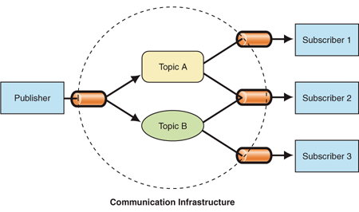

### Unity3d作业||模型与动画

1、智能巡逻兵

- 提交要求：
- 游戏设计要求：
  - 创建一个地图和若干巡逻兵(使用动画)；
  - 每个巡逻兵走一个3~5个边的凸多边型，位置数据是相对地址。即每次确定下一个目标位置，用自己当前位置为原点计算；
  - 巡逻兵碰撞到障碍物，则会自动选下一个点为目标；
  - 巡逻兵在设定范围内感知到玩家，会自动追击玩家；
  - 失去玩家目标后，继续巡逻；
  - 计分：玩家每次甩掉一个巡逻兵计一分，与巡逻兵碰撞游戏结束；
- 程序设计要求：
  - 必须使用订阅与发布模式传消息
    - subject：OnLostGoal
    - Publisher: ?
    - Subscriber: ?
  - 工厂模式生产巡逻兵
- 友善提示1：生成 3~5个边的凸多边型
  - 随机生成矩形
  - 在矩形每个边上随机找点，可得到 3 - 4 的凸多边型
  - 5 ?
- 友善提示2：参考以前博客，给出自己新玩法


####  订阅与发布模式 

   在“发布者-订阅者”模式中，称为发布者的消息发送者不会将消息编程为直接发送给称为订阅者的特定接收者。这意味着发布者和订阅者不知道彼此的存在。存在第三个组件，称为代理或消息代理或事件总线，它由发布者和订阅者都知道，它过滤所有传入的消息并相应地分发它们。换句话说，pub-sub是用于在不同系统组件之间传递消息的模式，而这些组件不知道关于彼此身份的任何信息。经纪人如何过滤所有消息？实际上，有几个消息过滤过程。最常用的方法有：基于主题和基于内容的。 



在本次游戏中，玩家结束游戏和得分的时候都会订阅一个服务，此时只需要让结束游戏或者得分这些情况产生的有效果定义GameEventManager发布的信息，通过这种方式实现功能的分类，降低代码的耦合。

UML


- 围墙

  由栅栏和石墙组成

  

- 玩家

  - 自由移动
  - 碰到巡逻兵游戏结束


​	预制体

​	需要给玩家添加一个 Capsule Collider

​    用于检测巡逻兵与玩家的碰撞 

​	

添加一个Player的脚本，控制对象的移动

```
using System;
using System.Collections.Generic;
using System.Linq;
using UnityEngine;

public class Player : MonoBehaviour
{
    public void FixedUpdate()
    {
        gameObject.GetComponent<Rigidbody>().freezeRotation = true;
        gameObject.GetComponent<Rigidbody>().velocity = new Vector3(0, 0, 0);
  

    }
}

```


- 巡逻兵

  要求

  - 每个巡逻兵走一个3~5个边的凸多边型，位置数据是相对地址。即每次确定下一个目标位置，用自己当前位置为原点计算；
  - 巡逻兵碰撞到障碍物，则会自动选下一个点为目标；
  - 巡逻兵在设定范围内感知到玩家，会自动追击玩家；

  预制体

  添加一个 Capsule Collider用于检测巡逻兵与玩家的碰撞 

  

  添加一个Boxcollider在预制体的子节点上用于检测玩家进入巡逻兵的巡逻范围

  

  挂上AreaCollide脚本

  ```
  public class AreaCollide : MonoBehaviour
  {
      public int sign;
      public delegate void CanFollow(int state,bool isEnter);
      public static event CanFollow canFollow;
  
      public delegate void AddScore();
      public static event AddScore addScore;
      void OnTriggerEnter(Collider collider)
      {
          if (collider.gameObject.tag == "Player")
          {
              canFollow(sign,true);
          }
      }
      private void OnTriggerExit(Collider collider)
      {
          if (collider.gameObject.tag == "Player")
          {
              canFollow(sign,false);
              addScore();
          }
      }
  }
  ```

  

  挂上Patrol的脚本和一个Patrolcolide的脚本

  Patrol.cs

  ```
   public enum PatrolState { PATROL,FOLLOW};
      public int sign;        //定义巡逻兵处于那个方块
      public bool isFollowPlayer = false;//此时是否检测到玩家，是否跟随
      public GameObject player=null;       
      public Vector3 startPos,nextPos;//位置
      private float minPosX,minPosZ;  // 定义可以移动的范围
      private bool isMoving = false;//是否移动
      private float distance;//记录距离
      private float speed = 1.2f;//速度
      PatrolState state = PatrolState.PATROL;//此时的状态，是否有玩家进入巡逻范围
  ```

  ```
  //每个巡逻兵开始初始化，定义初始位置
  private void Start()
      {
          minPosX = startPos.x - 2.5f;
          minPosZ = startPos.z - 2.5f;
          isMoving = false;
          AreaCollide.canFollow += changeStateToFollow;//改变状态
      }
  ```

  ```
   //定义巡逻兵的操作
   public void FixedUpdate()
      {
          if((SSDirector.getInstance().currentScenceController as FirstController).gameState == GameState.END)
          {
              return;//未初始化直接返回
          }
          if(state == PatrolState.PATROL)
          {
              GoPatrol();//自主巡逻状态Patrol
          }
          else if(state == PatrolState.FOLLOW)
          {
              Follow();//跟随玩家状态
          }
      }
  ```

  ```
  //自主巡逻
  public void GoPatrol()
      {
          if (isMoving)//定义巡逻的路线
          {
              transform.position = Vector3.MoveTowards(this.transform.position, nextPos, speed * Time.deltaTime);
              distance = Vector3.Distance(this.transform.position, nextPos);
              if(distance < 0.5)
              {
                  isMoving = false;
              }
              return;
          }
          float posX = Random.Range(0f, 5f);
          float posZ = Random.Range(0f, 5f);
          nextPos = new Vector3(minPosX+posX, 0, minPosZ+posZ);
          isMoving = true;    
      }
  ```

  ```
  //跟随玩家
  public void Follow()
      {
          if(player != null)
          {
              nextPos = player.transform.position;
              transform.position = Vector3.MoveTowards(this.transform.position, nextPos, speed * Time.deltaTime);
          }
      }
  ```

  ```
   //检测是否玩家进入巡逻范围，进行状态的变化
   public void changeStateToFollow(int sign_,bool isEnter)
      {
          if(sign == sign_ )
          {
              if (isEnter)
              {
                  state = PatrolState.FOLLOW;
                  player = (SSDirector.getInstance().currentScenceController as FirstController).player;
                  isFollowPlayer = true;
              }           
              else
              {
                  isFollowPlayer = false;
                  state = PatrolState.PATROL;
                  player = null;
                  isMoving = false;
              }
          }
          
      }
  ```

  patrolCollide.cs

  进行信号的捕捉

  ```
  public class PatrolCollide:MonoBehaviour
  {
      public delegate void CatchSuccess();
      public static event CatchSuccess catchSuccess;
      void OnTriggerEnter(Collider collider)
      {
          if (collider.gameObject.tag == "Player")
          {
              catchSuccess();        
          }
  
      }
  }
  ```

  巡逻兵的管理也使用工厂模式

  ```
  using System;
  using System.Collections.Generic;
  using System.Linq;
  using System.Text;
  using UnityEngine;
  
  public class PatrolFactory:MonoBehaviour
  {
      private List<GameObject> used = new List<GameObject>();    // the used patrol
      private Vector3[] PatrolPos = new Vector3[3];
      private bool isProduce = false;
      FirstController firstController;
      private void Start()
      {
          firstController = SSDirector.getInstance().currentScenceController as FirstController;
      }
      public List<GameObject> GetPatrols()
      {
          firstController = SSDirector.getInstance().currentScenceController as FirstController;
          if (!isProduce)
          {
              int index = 0;
              float[] posZ = { 3.75f, -3.75f };
              float[] posX = { 3.75f, -3.75f };
              for (int i = 0; i < 2; i++)
              {
                  for (int j = 0; j < 2; j++)
                  {
                      if(posX[j] > 0 && posZ[i] > 0)
                      {
                          continue;
                      }
                      PatrolPos[index++] = new Vector3(posX[j], 0, posZ[i]);
                  }
              }
              for (int i = 0; i < 3; i++)
              {
                  GameObject patrol = Instantiate(Resources.Load<GameObject>("Prefabs/Patrol"));
                  patrol.transform.parent = firstController.plane.transform;
                  patrol.transform.position = PatrolPos[i];
                  patrol.GetComponent<Patrol>().sign = i + 1;
                  patrol.GetComponent<Patrol>().startPos = PatrolPos[i];
                  used.Add(patrol);
              }
              isProduce = true;
          }     
          return used;
      }
  
      public void destoryFactory()
      {
          foreach(var a in used)
          {
              DestroyImmediate(a);
          }
          used = new List<GameObject>();
          isProduce = false;
      }
  }
  
  ```

  

- 相机移动部分

  相机规定要跟随玩家的移动

  ```
      public GameObject player;
      public FirstController sceneController;
      private Vector3 offset;
      // Use this for initialization  
      void Start()
      {
          sceneController = (FirstController)SSDirector.getInstance().currentScenceController;
          player = sceneController.player;
          offset = player.transform.position - this.transform.position;
      }
  
      // Update is called once per frame  
      void Update()
      {
          player = sceneController.player;
          if (sceneController.gameState == GameState.BEGIN)
              this.transform.position = player.transform.position - offset;
      }
  ```

  

- FirstControl

  定义变量，巡逻兵工厂，列表控制巡逻兵产生和毁灭，游戏状态和UI配合，得分计数器

  ```
   private PatrolFactory patrolFactory;
      public GameObject player;
      public List<GameObject> patrols;
      public GameObject plane;
      public GameState gameState;
      public ScoreRecorder scoreRecorder;
  ```

  ```
   //进行初始整体布局
   void Awake()
      {
          SSDirector director = SSDirector.getInstance();
          director.currentScenceController = this;
          patrolFactory = Singleton<PatrolFactory>.Instance;
          LoadResources();
          gameState = GameState.BEGIN;
          PatrolCollide.catchSuccess += Gameover;
          scoreRecorder = Singleton<ScoreRecorder>.Instance;
      }
      //加载资源，包括墙壁玩家
      public void LoadResources()
      {
          plane = Instantiate(Resources.Load<GameObject>("Prefabs/Plane"));
          plane.transform.position = Vector3.zero;
          patrols = patrolFactory.GetPatrols();
          player= Instantiate(Resources.Load<GameObject>("Prefabs/Player"));
          player.transform.position = new Vector3(1.8f, -0.35f,1.8f);
          //player.transform.Rotate(0, 180, 0);
      }
      //重新开始游戏
      public void ReStart()
      {     
          rush = player;
          rush.SetActive(false);
          player = null;
          player = Instantiate(Resources.Load<GameObject>("Prefabs/Player"));
          player.transform.position = new Vector3(1.8f, -0.35f, 1.8f);
          patrolFactory.destoryFactory();
          patrols = patrolFactory.GetPatrols();
          DestroyImmediate(rush);
  
          gameState = GameState.BEGIN;
      }
      //结束游戏
      public void Gameover()
      {
          gameState = GameState.END;
      }
  	//控制玩家移动
      public void PlayerMove(Vector3 pos) 
      {
              player.transform.Translate(pos);
      }
  ```

  

- ISceneController

  接口控制

- ScoreRecorder

  得分计数器

  ```
      int Score = 0;
      void SetScore()
      {
          Score++;
      }
      // Use this for initialization  
      void Start()
      {
          AreaCollide.addScore += SetScore;//订阅事件  
      }
  
      public int GetScore()
      {
          return Score;
      }
  ```

  

- Singleton

  单例模式

  ```
  public class Singleton<T> : MonoBehaviour where T : MonoBehaviour
  {
      protected static T instance;
      public static T Instance
      {
          get
          {
              if (instance == null)
              {
                  instance = (T)FindObjectOfType(typeof(T));
                  if (instance == null)
                  {
                      Debug.LogError("An instance of " + typeof(T)
                          + " is needed in the scene, but there is none.");
                  }
              }
              return instance;
          }
      }
  }
  ```

  

- SSDirector

  导演

  ```
  public class SSDirector : System.Object {
  
      private static SSDirector _instance;
  
      public ISceneController currentScenceController { get; set; }
      private SSDirector() { }
      public static SSDirector getInstance()
      {
          if (_instance == null)
          {
              _instance = new SSDirector();
          }
           return _instance;
      }
  
      public int getFPS()
      {
          return Application.targetFrameRate;
      }
      public void setFPS(int fps)
      {
          Application.targetFrameRate = fps;
      }
  }
  
  ```

  

- UI

  UI界面

  