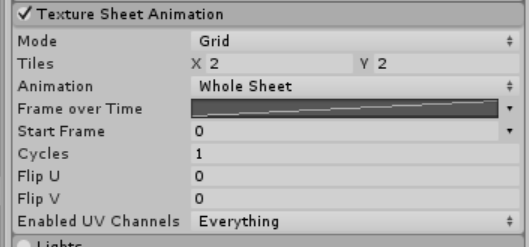
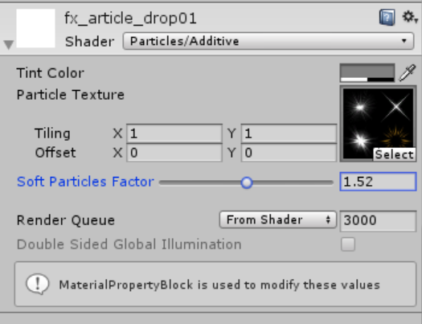

## Unity3d||粒子系统

简单粒子制作

- 按参考资源要求，制作一个粒子系统，[参考资源](http://www.cnblogs.com/CaomaoUnity3d/p/5983730.html)
- 使用 3.3 节介绍，用代码控制使之在不同场景下效果不一样


- 制作 **带有光晕的魔法球** 

  参考博客 https://www.cnblogs.com/CaomaoUnity3d/p/5983730.html 

  结构层次

  

  分别在Star实现周围的星光和在Ball实现闪烁的光球的两种效果

  - Ball

    首先需要添加组件Particle system

    按下图设置

    

    

    

    

    

    得到效果

    

  - star

    按下图设置

    

    

    

    

    

    实现效果

    

  最终光球的效果如下

  


- 用代码控制使之在不同场景下效果不一样

  在添加一个光晕效果Effect

  按下图设置

  

  ​	

  

  效果

  

  - 需要在MagicBall中挂载两个脚本，控制运动开始，控制星光轨迹

    点击事件

    ```
    
    using System.Collections;
    using System.Collections.Generic;
    using UnityEngine;
    
    public class MouseDown : MonoBehaviour
    {
    
        public GameObject obj;
        public int show_time = 8;                         //展示提示的时间长度
        void Start()
        {
            obj.SetActive(false);
            //展示提示
            StartCoroutine(ShowTip());
        }
    
        void OnMouseDown()
        {
            if (obj.active == true)
            {
                obj.SetActive(false);
            }
            else
            {
                obj.SetActive(true);
            }
        }
        private void OnGUI()
        {
            if (show_time > 0)
            {
                GUI.Label(new Rect(Screen.width / 2 - 50, 30, 150, 150), "点击魔法球展示特效");
            }
        }
        public IEnumerator ShowTip()
        {
            while (show_time >= 0)
            {
                yield return new WaitForSeconds(1);
                show_time--;
            }
        }
    }
    ```

    轨迹

    ```
    using System.Collections;
    using System.Collections.Generic;
    using UnityEngine;
    public struct FrameDate
    {
        //方向
        public Vector3 direction;
        //距离
        public float distance;
        public FrameDate(Vector3 dir, float dis)
        {
            direction = dir;
            distance = dis;
        }
    }
    
    public class ParticlePath : MonoBehaviour
    {
        //粒子系统
        public ParticleSystem particle;
        //路径指定达到的点的坐标
        public List<Vector3> points;
    
        //每个坐标轴的速度变化曲线
        private AnimationCurve curveX = new AnimationCurve();
        private AnimationCurve curveY = new AnimationCurve();
        private AnimationCurve curveZ = new AnimationCurve();
        //关键帧所需要保存的信息
        private Queue<FrameDate> frames = new Queue<FrameDate>();
    
        void Start()
        {
            if (points.Count > 1)
            {
                //设置粒子发生点
                particle.transform.position = points[0];
    
                //路径的总长
                float totalDistance = 0;
                for (int i = 1; i < points.Count; i++)
                {
                    //与下一个点距离
                    float dis = Vector3.Distance(points[i], points[i - 1]);
                    //向下一个点方向
                    Vector3 dir = points[i] - points[i - 1];
                    dir.Normalize();
                    frames.Enqueue(new FrameDate(dir, dis));
    
                    totalDistance += dis;
                }
                float time = 0;
                while (frames.Count > 0)
                {
                    //关键帧的数据
                    FrameDate data = frames.Dequeue();
                    //将当前时刻和坐标轴值作为关键帧添加进曲线
                    curveX.AddKey(new Keyframe(time, data.direction.x, float.PositiveInfinity, float.PositiveInfinity));
                    curveY.AddKey(new Keyframe(time, data.direction.y, float.PositiveInfinity, float.PositiveInfinity));
                    curveZ.AddKey(new Keyframe(time, data.direction.z, float.PositiveInfinity, float.PositiveInfinity));
                    //设置下一时刻的关键帧
                    time += (data.distance / totalDistance);
                }
                //设置粒子随着时间变化的速度
                var velocity = particle.velocityOverLifetime;
                velocity.enabled = true;
                velocity.space = ParticleSystemSimulationSpace.Local;
                //单位时间需要移动的长度
                float distancePerTime = totalDistance / particle.startLifetime;
                velocity.x = new ParticleSystem.MinMaxCurve(distancePerTime, curveX);
                velocity.y = new ParticleSystem.MinMaxCurve(distancePerTime, curveY);
                velocity.z = new ParticleSystem.MinMaxCurve(distancePerTime, curveZ);
            }
        }
    }
    
    ```

    将Effects挂载到脚本上

    

    最后效果

    

    

    