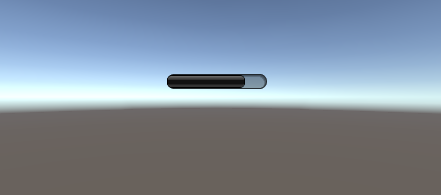
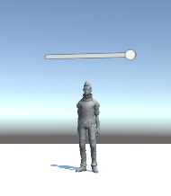
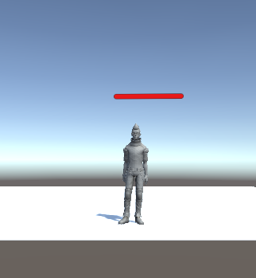

### Unity3d||血条制作

1、血条（Health Bar）的预制设计。具体要求如下

- 分别使用 IMGUI 和 UGUI 实现

  - IMGUI

    直接将下面代码挂载到一个空对象上就ok

    `````
    using System.Collections;
    using System.Collections.Generic;
    using UnityEngine;
    
    public class IMGUI : MonoBehaviour
    {
        public float healthPanelOffset = 2f;
        private void OnGUI()
        {
            Vector3 worldPos = new Vector3(transform.position.x, transform.position.y, transform.position.z);
            Vector2 screenPos = Camera.main.WorldToScreenPoint(worldPos);
            Rect rect = new Rect(screenPos.x - 50, screenPos.y, 100, 100);
            GUI.HorizontalScrollbar(rect, 0, 75, 0, 100);
        }
    }
    
    
    `````

    效果

    

    

  - UGUI

    - 菜单 Assets -> Import Package -> Characters 导入资源
    - 在层次视图，Context 菜单 -> 3D Object -> Plane 添加 Plane 对象
    - 资源视图展开 Standard Assets :: Charactors :: ThirdPersonCharater :: Prefab
    - 将 ThirdPersonController 预制拖放放入场景，改名为 Ethan
    - 检查以下属性
      - Plane 的 Transform 的 Position = (0,0,0)
      - Ethan 的 Transform 的 Position = (0,0,0)
      - Main Camera 的 Transform 的 Position = (0,1,-10)
    - 运行检查效果
    - 选择 Ethan 用上下文菜单 -> UI -> Canvas, 添加画布子对象
    - 选择 Ethan 的 Canvas，用上下文菜单 -> UI -> Slider 添加滑条作为血条子对象
    - 运行检查效果
    - 选择 Ethan 的 Canvas，在 Inspector 视图
      - 设置 Canvas 组件 Render Mode 为 World Space
      - 设置 Rect Transform 组件 (PosX，PosY，Width， Height) 为 (0,2,160,20)
      - - 设置 Rect Transform 组件 Scale （x,y） 为 (0.01,0.01)
    - 运行检查效果，应该是头顶 Slider 的 Ethan，用键盘移动 Ethan，观察

     

    - 展开 Slider
      - 选择 Handle Slider Area，禁灰（disable）该元素
      - 选择 Background，禁灰（disable）该元素
      - 选择 Fill Area 的 Fill，修改 Image 组件的 Color 为 红色
    - 选择 Slider 的 Slider 组件
      - 设置 MaxValue 为 100
      - 设置 Value 为 75
    - 运行检查效果，发现血条随人物旋转

    

- 使用 UGUI，血条是游戏对象的一个子元素，任何时候需要面对主摄像机

  添加脚本

  ```
  using UnityEngine;
  
  namespace LookAtCamera{
      public class LookAtCamera : MonoBehaviour 
      {
          void Update () 
          {
              this.transform.LookAt (Camera.main.transform.position);
          }
      }
  }
  
  ```

  

- 分析两种实现的优缺点

  - IMGUI'

    优点

     - 使用于简单的界面，可以使用代码直接实现。

    - 在修改模型，渲染模型这样的经典游戏循环编程模式中，在渲染阶段之后，绘制 UI 界面无可挑剔
    - 避免了 UI 元素保持在屏幕最前端，又有最佳的执行效率，一切控制掌握在程序员手中，这对早期计算和存储资源贫乏的游戏设备来说，更是弥足珍贵。

    缺点

    - 效率低，调试难

  - UGUI

    优点

    	- 方便设计师参与开发
    	- 支持多模式，多摄像机渲染
    	- 面向对象编程

    缺点

- 给出预制的使用方法

  IMGUI

  直接挂载代码

  UGUI

  World Space

  并将人物对象拖动到Slider中挂载的脚本HP Changed的Character中

  Screen Space

  并将人物对象拖动到ScreenOverlayHP中挂载的脚本Screen Overlay的Character中